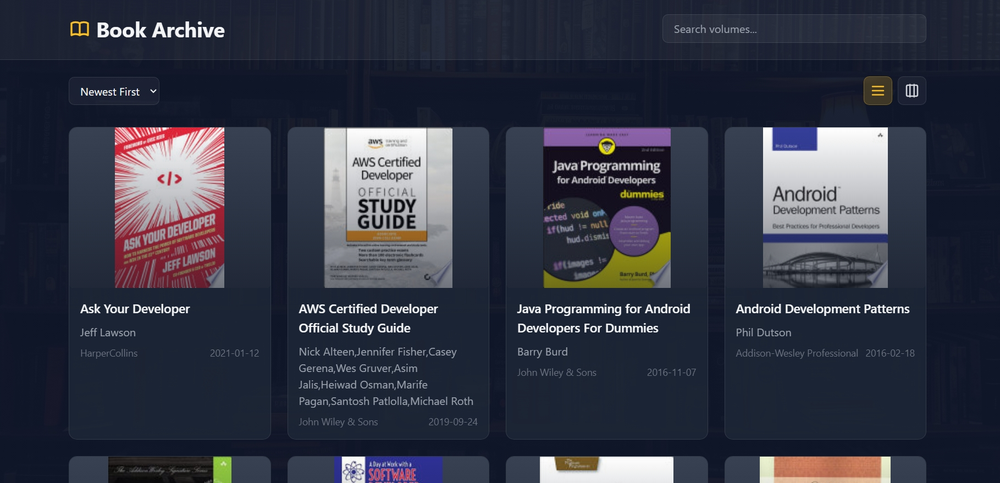
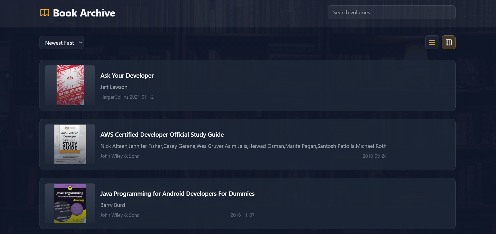
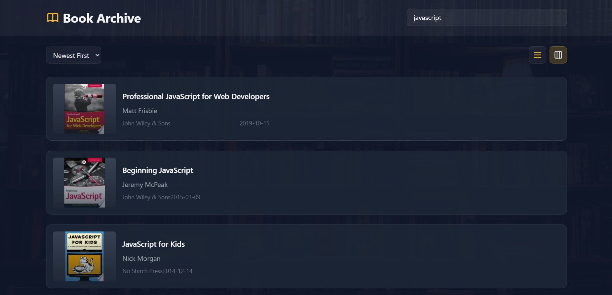

# Book Library

A dynamic and user-friendly book library that fetches book data from FreeAPI.app and displays it in an interactive and responsive interface.

## Table of Contents

- [Book Library](#book-libraray)
  - [Table of Contents](#table-of-contents)
  - [Deployment](#deployment)
  - [Features](#features)
  - [Technologies Used](#technologies-used)
  - [Installation](#installation)
  - [Preview](#preview)
  - [Acknowledgement](#acknowledgement)

## Deployment

- **Live link**: https://book-library-nu-jade.vercel.app

## Features
- **Responsive Design**: The project adjusts its layout based on the screen size, ensuring a great user experience on both desktop and mobile devices.
- **Fetch Books from API**: Dynamically loads book data.
- **List/Grid View Toogle**: Users can switch between list and grid views.
- **Detailed Book Information**: Displays title, author, publisher, published date and thumbnail.
- **Search Functionality**: Filter books by title or author.
- **Sorting Options**: Sort books alphabetically or by release date.
- **Pagination**: Loads more books.
- **Book Details Page**: Clicking on a book opens more details in a new tab.

## Technologies Used

- **HTML5**: For the structure of the project.
- **TAILWIND CSS**: For styling and responsive design.
- **JavaScript**: For interactive elements.

## Installation

1. Clone the repository:
   ```bash
   git clone https://github.com/Depkstha/library.git
   ```

2. Navigate into the project directory:
   ```bash
   cd library
   ```

3. Open `index.html` in your web browser to view the project.

## Preview
This is what it looks like




## Acknowledgement
This project is part of an assignment from Cohort on Masterji. Special thanks to Hitesh sir, Piyush sir, and the entire team for their guidance and support. Excited to be part of this amazing learning journey!
